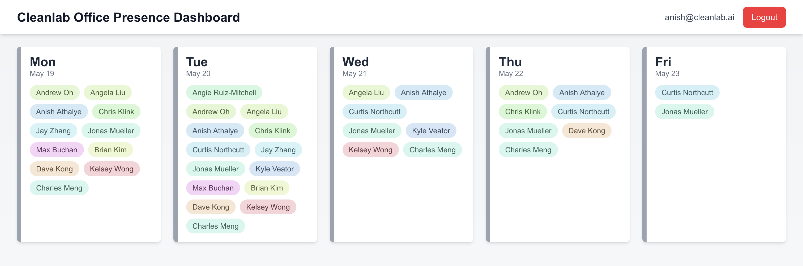
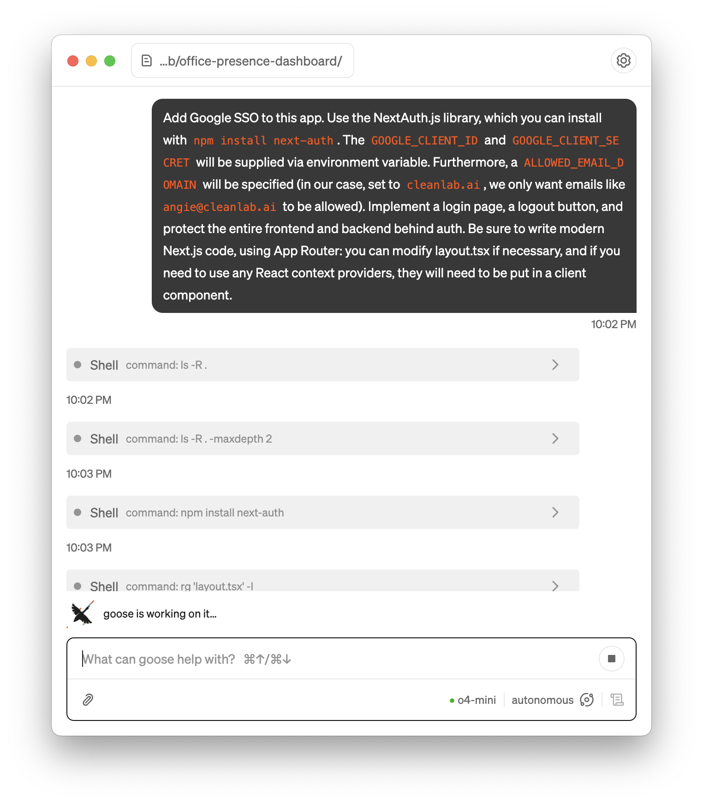

# Cleanlab Office Presence Dashboard



## Development Process

The app was developed end-to-end in about three hours using [Goose](https://block.github.io/goose/).  

- Initial scaffolding created with `create-next-app`.  
- All other changes were vibe coded using Goose—from `git init` to `vercel deploy --prod`. I didn’t edit a single line of code directly, and I haven’t read most of the lines in this project.  
- OpenAI models used: `o1`, `o3`, and `o4-mini`.  
- Total development cost (API calls): < $50. I experimented with different models; cost could be < $5 if using `o4-mini` exclusively.  

<div align="center">
  
</div>

I didn’t save all prompts used during development, but most commits represent the work done from a single prompt (with occasional follow-ups). Future commits will include prompts in the commit messages.

## Overview

This Next.js app displays who plans to be in the office each day, using Google SSO (via NextAuth.js) and fetching data from the Forkable API.

## Features

- Google SSO restricted to a specific email domain (`cleanlab.ai`).  
- Server- and client-side route protection.  
- Forkable API integration with a 30-day cached session cookie.  
- Responsive dashboard UI with modern styling.

## Getting Started

Install dependencies and run the development server:

```bash
npm install
npm run dev
```

Open <http://localhost:3000> in your browser.

## Environment Variables

Create a `.env.local` file in the project root with the following:

```bash
GOOGLE_CLIENT_ID=...
GOOGLE_CLIENT_SECRET=...
NEXTAUTH_SECRET=...
ALLOWED_EMAIL_DOMAIN=cleanlab.ai
FORKABLE_ADMIN_EMAIL=...
FORKABLE_ADMIN_PASSWORD=...
FORKABLE_CLUB_IDS=123,456
```

## Deployment

Deploy on Vercel or any Node.js hosting platform. Ensure your environment variables are set in your deployment settings.
